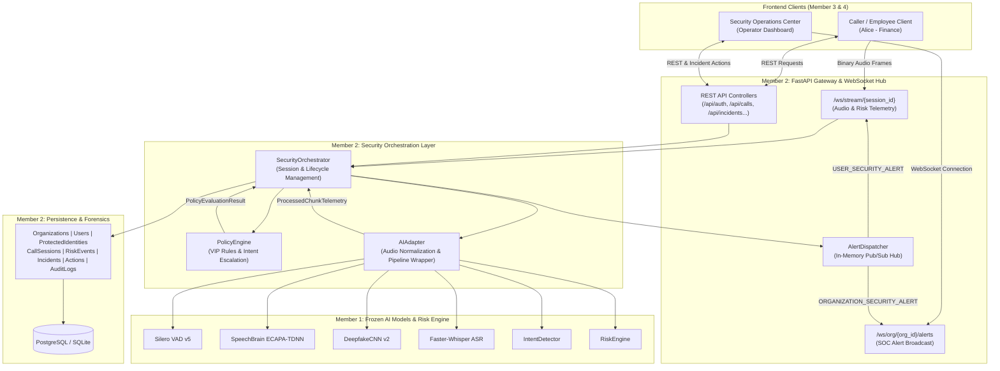

# VoiceCloneDetection-SIH: Member 2 Technical Documentation Knowledge Base

**Scope**: Backend Platform, Security Orchestration, and System Integration  
**Project**: AI Real-Time Detection & Prevention of Voice-Cloning Impersonation Attacks (Smart India Hackathon)  
**Document Authoritative Source**: Repository Source Code & Live Telemetry Verification

---

## 1. Executive Summary: Member 2 Responsibility

Member 2 owns the **Backend Platform, Security Orchestration, Real-Time Streaming Gateway, and Enterprise Administration** layer of the VoiceCloneDetection-SIH project.

While Member 1 provides the core acoustic intelligence and frozen neural models (Silero VAD, DeepfakeCNN v2, SpeechBrain ECAPA-TDNN, Whisper ASR, IntentDetector, and RiskEngine), **Member 2 builds the complete operational platform around it**:
- **Real-Time Streaming Engine**: Accepts binary audio frames from caller clients over WebSockets and coordinates real-time AI chunk inferences.
- **Security Orchestration**: Connects raw AI probabilities with multi-tenant enterprise policies, protected executive VIP rules (e.g. CFO), and social engineering intent detection.
- **Session-Aware Incident Deduplication**: Maintains exactly one consolidated security incident per attack call session, preventing SOC alert storms.
- **Simultaneous Dual Alert Dispatching**: Pushes urgent warning banners to the caller's interface while broadcasting high-priority incident notifications to SOC operator dashboards.
- **Security Action Mitigations**: Provides operators with one-click actions (`BLOCK_CALL`, `CONFIRM_ATTACK`, `FALSE_POSITIVE`, `RESOLVE`), forcefully terminating fraudulent calls at the application layer.
- **Multi-Tenant Data Isolation & RBAC**: Enforces strict organization boundaries and role-based permissions (`USER`, `SECURITY_OPERATOR`, `ADMIN`).
- **Immutable Forensic Audit Trail**: Records a tamper-proof chronological history of all security-relevant events (`CALL_STARTED`, `INCIDENT_CREATED`, `SECURITY_ACTION_TAKEN`, `CALL_ENDED`).

---

## 2. High-Level Architecture

---

## 3. Master Documentation Directory

This documentation set is organized into 10 structured sections:

### 3.1 Architecture Specifications (`docs/architecture/`)
- [System Overview](file:///Users/dhurgadevi/Documents/GitHub/VoiceCloneDetection-SIH/docs/architecture/overview.md): High-level system goals and component boundaries.
- [System Architecture](file:///Users/dhurgadevi/Documents/GitHub/VoiceCloneDetection-SIH/docs/architecture/system-architecture.md): Detailed architectural components and multi-layer diagram.
- [Request Lifecycle](file:///Users/dhurgadevi/Documents/GitHub/VoiceCloneDetection-SIH/docs/architecture/request-lifecycle.md): End-to-end execution of HTTP and WebSocket requests.
- [Real-Time Flow](file:///Users/dhurgadevi/Documents/GitHub/VoiceCloneDetection-SIH/docs/architecture/realtime-flow.md): Sub-second audio streaming, chunk processing, and latency budgets.
- [Security Orchestration](file:///Users/dhurgadevi/Documents/GitHub/VoiceCloneDetection-SIH/docs/architecture/security-orchestration.md): Security decision lifecycle and automated responses.
- [Data Flow](file:///Users/dhurgadevi/Documents/GitHub/VoiceCloneDetection-SIH/docs/architecture/data-flow.md): Data ingestion, transformation, in-memory caching, and persistence.
- [Module Dependency Map](file:///Users/dhurgadevi/Documents/GitHub/VoiceCloneDetection-SIH/docs/architecture/module-dependency-map.md): Package import hierarchies and coupling rules.

### 3.2 Backend Platform Components (`docs/backend/`)
- [Server Factory](file:///Users/dhurgadevi/Documents/GitHub/VoiceCloneDetection-SIH/docs/backend/server.md): FastAPI application lifecycle, startup hooks, and CORS middleware.
- [REST API Architecture](file:///Users/dhurgadevi/Documents/GitHub/VoiceCloneDetection-SIH/docs/backend/api.md): REST routing conventions, error schemas, and response standards.
- [Authentication](file:///Users/dhurgadevi/Documents/GitHub/VoiceCloneDetection-SIH/docs/backend/authentication.md): PBKDF2 password hashing and PyJWT token generation.
- [Authorization & RBAC](file:///Users/dhurgadevi/Documents/GitHub/VoiceCloneDetection-SIH/docs/backend/authorization-rbac.md): Role gates (`USER`, `SECURITY_OPERATOR`, `ADMIN`) and tenant isolation.
- [WebSocket Architecture](file:///Users/dhurgadevi/Documents/GitHub/VoiceCloneDetection-SIH/docs/backend/websocket.md): Streaming audio protocol and broadcast alert hub.
- [Session Management](file:///Users/dhurgadevi/Documents/GitHub/VoiceCloneDetection-SIH/docs/backend/session-management.md): In-memory active call state and database synchronization.
- [Configuration](file:///Users/dhurgadevi/Documents/GitHub/VoiceCloneDetection-SIH/docs/backend/configuration.md): Environment settings and platform defaults.

### 3.3 AI Integration Layer (`docs/ai-integration/`)
- [AI Integration Overview](file:///Users/dhurgadevi/Documents/GitHub/VoiceCloneDetection-SIH/docs/ai-integration/overview.md): Guarantees regarding Member 1 frozen code.
- [AI Adapter](file:///Users/dhurgadevi/Documents/GitHub/VoiceCloneDetection-SIH/docs/ai-integration/ai-adapter.md): Singleton wrapper, in-memory normalization, and session management.
- [Member 1 Integration Boundary](file:///Users/dhurgadevi/Documents/GitHub/VoiceCloneDetection-SIH/docs/ai-integration/member1-integration.md): Neural components consumed and outputs extracted.
- [Audio Ingestion & Normalization](file:///Users/dhurgadevi/Documents/GitHub/VoiceCloneDetection-SIH/docs/ai-integration/audio-ingestion.md): 16 kHz mono float32 normalization.
- [Inference to Risk Flow](file:///Users/dhurgadevi/Documents/GitHub/VoiceCloneDetection-SIH/docs/ai-integration/inference-to-risk-flow.md): Translation of acoustic probabilities into actionable risk scores.

### 3.4 Database & Persistence (`docs/database/`)
- [Database Overview](file:///Users/dhurgadevi/Documents/GitHub/VoiceCloneDetection-SIH/docs/database/overview.md): Persistence guarantees and raw audio privacy rules.
- [Database Schema](file:///Users/dhurgadevi/Documents/GitHub/VoiceCloneDetection-SIH/docs/database/schema.md): Relational schema diagram and table structures.
- [SQLAlchemy Models](file:///Users/dhurgadevi/Documents/GitHub/VoiceCloneDetection-SIH/docs/database/models.md): Entity definitions and serialization methods.
- [Repositories & Adapters](file:///Users/dhurgadevi/Documents/GitHub/VoiceCloneDetection-SIH/docs/database/repositories.md): `DatabaseSpeakerRepository` implementation.
- [Entity Relationships](file:///Users/dhurgadevi/Documents/GitHub/VoiceCloneDetection-SIH/docs/database/relationships.md): Foreign keys, cascading deletes, and indexes.
- [Persistence Flow](file:///Users/dhurgadevi/Documents/GitHub/VoiceCloneDetection-SIH/docs/database/persistence-flow.md): Transaction boundaries and commit strategies.
- [PostgreSQL & SQLite Configuration](file:///Users/dhurgadevi/Documents/GitHub/VoiceCloneDetection-SIH/docs/database/postgresql.md): Engine settings, pool pre-ping, and SQLite fallback.

### 3.5 Security & Policy Subsystem (`docs/security/`)
- [Policy Engine](file:///Users/dhurgadevi/Documents/GitHub/VoiceCloneDetection-SIH/docs/security/policy-engine.md): Thresholds, VIP rules, and sensitive intent escalation.
- [Risk Orchestration](file:///Users/dhurgadevi/Documents/GitHub/VoiceCloneDetection-SIH/docs/security/risk-orchestration.md): Scoring formulas and categorical risk tiers.
- [Alert Routing Hub](file:///Users/dhurgadevi/Documents/GitHub/VoiceCloneDetection-SIH/docs/security/alert-routing.md): Multi-tenant alert pub/sub hub.
- [Incident Management](file:///Users/dhurgadevi/Documents/GitHub/VoiceCloneDetection-SIH/docs/security/incident-management.md): Incident lifecycle from triage to resolution.
- [Incident Deduplication](file:///Users/dhurgadevi/Documents/GitHub/VoiceCloneDetection-SIH/docs/security/incident-deduplication.md): Session-aware deduplication algorithm.
- [Security Actions](file:///Users/dhurgadevi/Documents/GitHub/VoiceCloneDetection-SIH/docs/security/security-actions.md): Operator mitigations (`BLOCK_CALL`, `CONFIRM_ATTACK`, etc.).
- [Audit Logging](file:///Users/dhurgadevi/Documents/GitHub/VoiceCloneDetection-SIH/docs/security/audit-logging.md): Compliance audit trails and forensic immutability.
- [Tenant Isolation](file:///Users/dhurgadevi/Documents/GitHub/VoiceCloneDetection-SIH/docs/security/tenant-isolation.md): Cryptographic and database boundaries between organizations.

### 3.6 API Reference Specifications (`docs/api-reference/`)
- [Authentication APIs](file:///Users/dhurgadevi/Documents/GitHub/VoiceCloneDetection-SIH/docs/api-reference/authentication.md): `POST /api/auth/login`, `GET /api/auth/me`.
- [Call Session APIs](file:///Users/dhurgadevi/Documents/GitHub/VoiceCloneDetection-SIH/docs/api-reference/calls.md): `POST /api/calls`, `GET /api/calls/{id}`, `POST /api/calls/{id}/finish`.
- [Real-Time Streaming APIs](file:///Users/dhurgadevi/Documents/GitHub/VoiceCloneDetection-SIH/docs/api-reference/streaming.md): `/ws/stream/{session_id}`, `/ws/org/{org_id}/alerts`.
- [Protected Identity APIs](file:///Users/dhurgadevi/Documents/GitHub/VoiceCloneDetection-SIH/docs/api-reference/protected-identities.md): Registration and biometric enrollment endpoints.
- [Security Incident APIs](file:///Users/dhurgadevi/Documents/GitHub/VoiceCloneDetection-SIH/docs/api-reference/incidents.md): Incident triage, filtering, and detail endpoints.
- [Security Action APIs](file:///Users/dhurgadevi/Documents/GitHub/VoiceCloneDetection-SIH/docs/api-reference/security-actions.md): `POST /api/incidents/{id}/action`.
- [Audit Log APIs](file:///Users/dhurgadevi/Documents/GitHub/VoiceCloneDetection-SIH/docs/api-reference/audit-logs.md): `GET /api/audit-logs`.
- [Security Policy APIs](file:///Users/dhurgadevi/Documents/GitHub/VoiceCloneDetection-SIH/docs/api-reference/policies.md): `GET /api/policies`, `PUT /api/policies`.
- [Health & Telemetry APIs](file:///Users/dhurgadevi/Documents/GitHub/VoiceCloneDetection-SIH/docs/api-reference/health.md): `GET /api/health`, `GET /api/stats`.

### 3.7 Module-by-Module Technical Documentation (`docs/modules/`)
- [Server Factory](file:///Users/dhurgadevi/Documents/GitHub/VoiceCloneDetection-SIH/docs/modules/server/app.md) & [Server Dependencies](file:///Users/dhurgadevi/Documents/GitHub/VoiceCloneDetection-SIH/docs/modules/server/dependencies.md)
- [API Routes Catalog](file:///Users/dhurgadevi/Documents/GitHub/VoiceCloneDetection-SIH/docs/modules/api/overview.md)
- [Services Overview](file:///Users/dhurgadevi/Documents/GitHub/VoiceCloneDetection-SIH/docs/modules/services/overview.md):
  - [Security Orchestrator](file:///Users/dhurgadevi/Documents/GitHub/VoiceCloneDetection-SIH/docs/modules/services/orchestrator.md)
  - [AI Adapter](file:///Users/dhurgadevi/Documents/GitHub/VoiceCloneDetection-SIH/docs/modules/services/ai_adapter.md)
  - [Alert Dispatcher](file:///Users/dhurgadevi/Documents/GitHub/VoiceCloneDetection-SIH/docs/modules/services/alert_dispatcher.md)
  - [Policy Engine](file:///Users/dhurgadevi/Documents/GitHub/VoiceCloneDetection-SIH/docs/modules/services/policy_engine.md)
  - [Authentication Service](file:///Users/dhurgadevi/Documents/GitHub/VoiceCloneDetection-SIH/docs/modules/services/auth_service.md)
  - [Speaker Service](file:///Users/dhurgadevi/Documents/GitHub/VoiceCloneDetection-SIH/docs/modules/services/speaker_service.md)
- [Database Models](file:///Users/dhurgadevi/Documents/GitHub/VoiceCloneDetection-SIH/docs/modules/database/models.md), [Database Session](file:///Users/dhurgadevi/Documents/GitHub/VoiceCloneDetection-SIH/docs/modules/database/session.md), [Speaker Repo Adapter](file:///Users/dhurgadevi/Documents/GitHub/VoiceCloneDetection-SIH/docs/modules/database/speaker_repo_adapter.md)
- [Pydantic Schemas Overview](file:///Users/dhurgadevi/Documents/GitHub/VoiceCloneDetection-SIH/docs/modules/schemas/overview.md)
- [Security Module](file:///Users/dhurgadevi/Documents/GitHub/VoiceCloneDetection-SIH/docs/modules/security/overview.md) & [WebSocket Module](file:///Users/dhurgadevi/Documents/GitHub/VoiceCloneDetection-SIH/docs/modules/websocket/overview.md)

### 3.8 Verification & Testing (`docs/testing/`)
- [Testing Overview](file:///Users/dhurgadevi/Documents/GitHub/VoiceCloneDetection-SIH/docs/testing/overview.md): Testing methodology, levels, and invariants.
- [Test Suite Matrix](file:///Users/dhurgadevi/Documents/GitHub/VoiceCloneDetection-SIH/docs/testing/test-suite.md): Commands, coverage, and Pytest fixtures.
- [Test-by-Test Audit](file:///Users/dhurgadevi/Documents/GitHub/VoiceCloneDetection-SIH/docs/testing/test-by-test.md): Rigorous audit of all 20 automated tests.
- [11-Point Live Server Validation](file:///Users/dhurgadevi/Documents/GitHub/VoiceCloneDetection-SIH/docs/testing/live-validation.md): Ground-truth telemetry from the live test run on `http://localhost:8000`.
- [WebSocket Testing](file:///Users/dhurgadevi/Documents/GitHub/VoiceCloneDetection-SIH/docs/testing/websocket-testing.md): Automated and live socket streaming tests.
- [AI End-to-End Testing](file:///Users/dhurgadevi/Documents/GitHub/VoiceCloneDetection-SIH/docs/testing/ai-e2e-testing.md): Execution performance, real-time factors, and scenarios.
- [Manual Verification Guide](file:///Users/dhurgadevi/Documents/GitHub/VoiceCloneDetection-SIH/docs/testing/manual-verification.md): Reproduction instructions and Swagger walk-through.

### 3.9 Integration & Frontend Contracts (`docs/integration/`)
- [Member 1 AI Boundary](file:///Users/dhurgadevi/Documents/GitHub/VoiceCloneDetection-SIH/docs/integration/member1.md): Frozen core contract and data transformations.
- [Member 3 (Employee UI) Contract](file:///Users/dhurgadevi/Documents/GitHub/VoiceCloneDetection-SIH/docs/integration/member3.md): Caller screens, microphone streaming, and alerts.
- [Member 4 (SOC Dashboard) Contract](file:///Users/dhurgadevi/Documents/GitHub/VoiceCloneDetection-SIH/docs/integration/member4.md): Operator triage, evidence viewer, and mitigation controls.
- [Frontend Unified Contracts](file:///Users/dhurgadevi/Documents/GitHub/VoiceCloneDetection-SIH/docs/integration/frontend-contracts.md): TypeScript interfaces and JSON message envelopes.
- [Canonical SIH Demonstration](file:///Users/dhurgadevi/Documents/GitHub/VoiceCloneDetection-SIH/docs/integration/end-to-end-demo.md): AI-cloned CFO attack scenario and demonstration script.

### 3.10 Operations & Limitations (`docs/operations/`)
- [Installation Guide](file:///Users/dhurgadevi/Documents/GitHub/VoiceCloneDetection-SIH/docs/operations/installation.md): Environment prerequisites and package setup.
- [Running Services](file:///Users/dhurgadevi/Documents/GitHub/VoiceCloneDetection-SIH/docs/operations/running.md): Development server, production deployment, and seed accounts.
- [Environment Configuration](file:///Users/dhurgadevi/Documents/GitHub/VoiceCloneDetection-SIH/docs/operations/environment.md): Environment variable catalog and defaults.
- [Troubleshooting & Diagnostics](file:///Users/dhurgadevi/Documents/GitHub/VoiceCloneDetection-SIH/docs/operations/troubleshooting.md): Common error codes, 401/403 solutions, and health probes.
- [Limitations & Verification Status](file:///Users/dhurgadevi/Documents/GitHub/VoiceCloneDetection-SIH/docs/operations/limitations.md): Explicit delineation of real vs. simulated capabilities.
