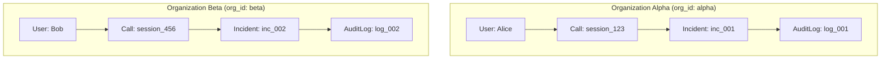

# Data Flow: Information Transformation Across Layers

## 1. Data Transformation Pipeline

Information undergoes six transformations between raw browser microphone input and persisted security analytics:

```
[Level 0: Network Audio Frame]
  Binary PCM / WAV Bytes (e.g. 32,000 bytes int16, 16kHz mono)
       │
       ▼ (AIAdapter.decode_input_audio)
[Level 1: Normalized Acoustic Waveform]
  Numpy ndarray: float32, 1D, shape=(16000,), normalized to [-1.0, 1.0]
       │
       ▼ (StreamingAudioPipeline.process_chunk)
[Level 2: AI Intelligence Results (Member 1)]
  StreamingChunkResult:
    - vad_result (speech_detected, speech_probability)
    - deepfake_result (synthetic_probability, is_synthetic)
    - speaker_verification_result (similarity, is_match)
    - whisper_result (transcript, confidence)
    - intent_result (intent, confidence, keywords)
    - risk_decision (risk_score, risk_level, scenario, reasons)
       │
       ▼ (AIAdapter._map_chunk_result)
[Level 3: Platform Telemetry DTO]
  ProcessedChunkTelemetry:
    - Normalized unified interface consumed by SecurityOrchestrator
       │
       ▼ (PolicyEngine.evaluate)
[Level 4: Enterprise Security Decision]
  PolicyEvaluationResult:
    - risk_score, risk_level
    - should_warn_user (bool), should_alert_org (bool)
    - should_create_incident (bool), is_blocked (bool)
    - warning_message, reasons
       │
       ▼ (SecurityOrchestrator._persist_and_dispatch)
[Level 5: Relational Persistence & Wire Protocols]
  - DB Models: RiskEvent, SecurityIncident, CallSession, AuditLog
  - Outgoing WebSocket JSON: RISK_UPDATE, USER_SECURITY_ALERT, ORGANIZATION_SECURITY_ALERT
```

---

## 2. In-Flight vs Persisted State

### What is In-Flight (Transient)
- **Raw Audio Data**: Ingested in memory, processed through PyTorch tensors, and immediately deallocated. Never written to disk or database.
- **WebSocket Connections**: Stored in `AlertDispatcher` in memory. Cleaned up automatically upon socket closure.
- **Rolling Buffers**: Member 1's `StreamingAudioPipeline` maintains a rolling 4.0-second FIFO audio buffer in memory for continuous feature extraction.

### What is Persisted
- **Metadata**: Call session start/end times, caller identification, claimed identity IDs.
- **Biometric Vectors**: 192-dimensional floating point embeddings stored as serialized binary vector blobs in `speaker_profiles`.
- **Acoustic Telemetry**: High-level numerical metrics (`synthetic_prob`, `speaker_sim`, `risk_score`) in `risk_events`.
- **Transcripts**: Spoken words captured by Whisper ASR stored in `call_sessions.accumulated_transcript` for security audits.
- **Incidents & Actions**: Full triage records, operator mitigation notes, and immutable audit logs.

---

## 3. Multi-Tenant Data Scoping

All database entities and WebSocket events maintain tenant partitioning:



- **Query Isolation**: Every SQL query is automatically scoped with `.filter_by(org_id=user.org_id)`.
- **Event Isolation**: `AlertDispatcher.send_to_org(org_id, payload)` filters broadcasts strictly to connections registered with matching `org_id`.

---

## 4. Source Files Covered
- `backend/platform/services/ai_adapter.py`
- `backend/platform/services/policy_engine.py`
- `backend/platform/services/orchestrator.py`
- `backend/platform/db/models.py`
- `backend/platform/schemas/events.py`
