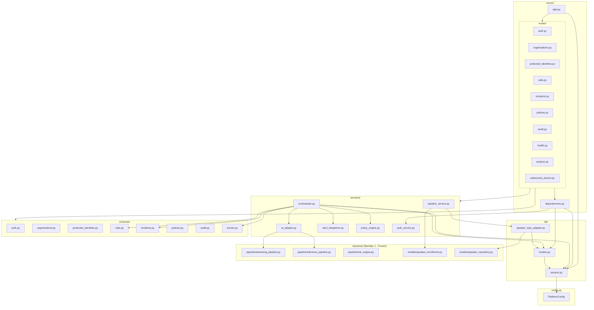

# Module Dependency Map

## 1. Inter-Module Dependency Graph

---

## 2. Dependency Invariants & Layering Rules

1. **No Circular Dependencies**:
   - `schemas/` depends only on Pydantic and standard library. Never imports from `services/`, `server/`, or `db/`.
   - `db/` depends on SQLAlchemy and standard library. `models.py` never imports from `services/` or `server/`.
   - `services/` depends on `db/`, `schemas/`, `config.py`, and Member 1 AI models.
   - `server/` depends on `services/`, `schemas/`, `db/`, and `dependencies.py`.
2. **Member 1 Isolation**:
   - Only `AIAdapter` (`services/ai_adapter.py`) and `DatabaseSpeakerRepository` (`db/speaker_repo_adapter.py`) directly import Member 1 AI modules.
   - All other platform files consume Member 2 DTOs and adapters.

---

## 3. Source Files Covered
- `backend/platform/config.py`
- `backend/platform/db/*`
- `backend/platform/schemas/*`
- `backend/platform/services/*`
- `backend/platform/server/*`
