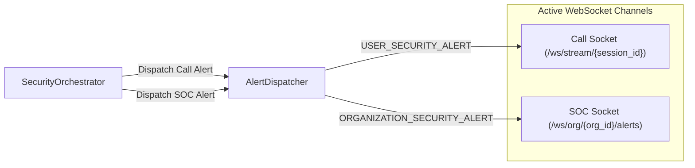

# Real-Time Flow: Audio Ingestion, Telemetry & Concurrent Alerting

## 1. The Real-Time Audio Processing Pipeline

The platform is designed to process streaming audio with near-real-time latency (< 500 ms per 1.0-second chunk) to prevent fraud while the caller is still speaking.

```
Client Microphone (Web Audio API)
       │
       │ 1.0s chunks (16 kHz, mono, 16-bit PCM: 32,000 bytes)
       ▼
WebSocket Endpoint (/ws/stream/{session_id})
       │
       │ Binary Frame Ingestion
       ▼
AIAdapter (Normalizes bytes -> float32 [-1.0, 1.0])
       │
       ▼
Member 1 StreamingAudioPipeline
       ├── 1. Silero VAD (Speech vs Silence Gating)
       ├── 2. DeepfakeCNN v2 (Synthetic Speech Detection)
       ├── 3. SpeechBrain ECAPA-TDNN (Biometric Speaker Verification)
       ├── 4. Faster-Whisper (Int8 Automatic Speech Recognition)
       ├── 5. IntentDetector (Social Engineering Keyword Engine)
       └── 6. RiskEngine (Acoustic Multi-Factor Evaluation)
       │
       │ ProcessedChunkTelemetry
       ▼
SecurityOrchestrator
       │
       ├── Persist RiskEvent in SQL
       ├── Evaluate Organizational Policy (VIP & Sensitive Intent)
       ├── Session-Aware Incident Deduplication
       │
       ▼
AlertDispatcher (Concurrent Fan-out)
       ├── Call Socket -> RISK_UPDATE
       ├── If Risk >= HIGH:
       │     ├── Call Socket -> USER_SECURITY_ALERT
       │     └── SOC Socket  -> ORGANIZATION_SECURITY_ALERT
       └── If Policy Auto-Block:
             └── Call Socket -> CALL_ENDED (Reason: BLOCKED_BY_POLICY)
```

---

## 2. Ingestion Specifications

### Expected Audio Format
- **Sample Rate**: 16,000 Hz (16 kHz)
- **Channels**: 1 (Mono)
- **Bit Depth**: 16-bit signed integer PCM, or standard WAV container.
- **Chunk Cadence**: 1.0 second chunks (~32,000 bytes).
- **Decoder Resilience**: Implemented in `AIAdapter.decode_input_audio()`:
  - If bytes start with `RIFF...WAVE`, decodes via `soundfile.read()`.
  - If raw PCM, converts via `np.frombuffer(audio_bytes, dtype=np.int16).astype(np.float32) / 32768.0`.
  - Handles float32 arrays natively.

---

## 3. Real-Time Telemetry Payloads

Every audio chunk produces a `RISK_UPDATE` event broadcast to the caller socket.

### Payload Schema (`RiskUpdatePayload`)
- `session_id`: Unique call session ID.
- `chunk_id`: Sequential chunk integer.
- `timestamp`: ISO-8601 UTC timestamp.
- `speech_detected`: Boolean indicating whether human speech was detected by VAD.
- `risk_score`: Float between 0.0 and 100.0.
- `risk_level`: `SAFE`, `LOW`, `MEDIUM`, `HIGH`, or `CRITICAL`.
- `synthetic_probability`: Raw deepfake probability `[0.0, 1.0]`.
- `smoothed_synthetic_probability`: Exponential moving average (EMA) of synthetic probability.
- `speaker_similarity`: Raw cosine similarity against enrolled VIP profile `[-1.0, 1.0]`.
- `smoothed_speaker_similarity`: EMA of speaker similarity.
- `speaker_match`: Boolean match verdict.
- `identity_status`: `MATCHED`, `MISMATCHED`, or `UNENROLLED`.
- `transcript`: ASR transcription of the current chunk.
- `accumulated_transcript`: Full transcription of call to date.
- `intent`: Classified intent (`NORMAL_CONVERSATION`, `OTP_REQUEST`, `PAYMENT_TRANSFER`, etc.).
- `verdict`: `genuine`, `cloned`, `imposter`, or `inconclusive`.
- `reasons`: Human-readable justification strings.
- `recommended_action`: Recommended intervention (`ALLOW`, `WARN_USER`, `BLOCK_OR_ESCALATE`).
- `latency_ms`: Execution time in milliseconds.

---

## 4. Concurrent Dual Alerting Mechanism

When a chunk crosses the `high_risk_threshold` (default: 70.0) or `critical_risk_threshold` (default: 85.0), the platform triggers simultaneous alerts.



### 4.1 `USER_SECURITY_ALERT`
- **Destination**: The active caller's WebSocket connection.
- **Visual Impact**: Rendered as a full-screen red security alert banner in the user UI.
- **Guidance**: Direct instructions to the employee: *"Do NOT share OTPs or transfer funds. The caller's voice is synthetic."*

### 4.2 `ORGANIZATION_SECURITY_ALERT`
- **Destination**: All active SOC operator consoles registered under `org_id`.
- **Telemetry Provided**: Full acoustic metrics (synthetic score, speaker similarity, claimed identity, transcript, detected intent).
- **Incident Association**: Contains the generated `incident_id` allowing instant operator intervention.

---

## 5. Source Files Covered
- `backend/platform/services/orchestrator.py`
- `backend/platform/services/alert_dispatcher.py`
- `backend/platform/services/ai_adapter.py`
- `backend/platform/schemas/events.py`
