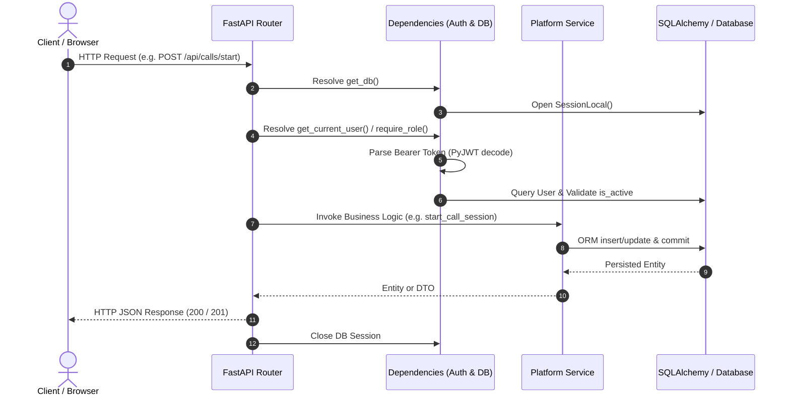
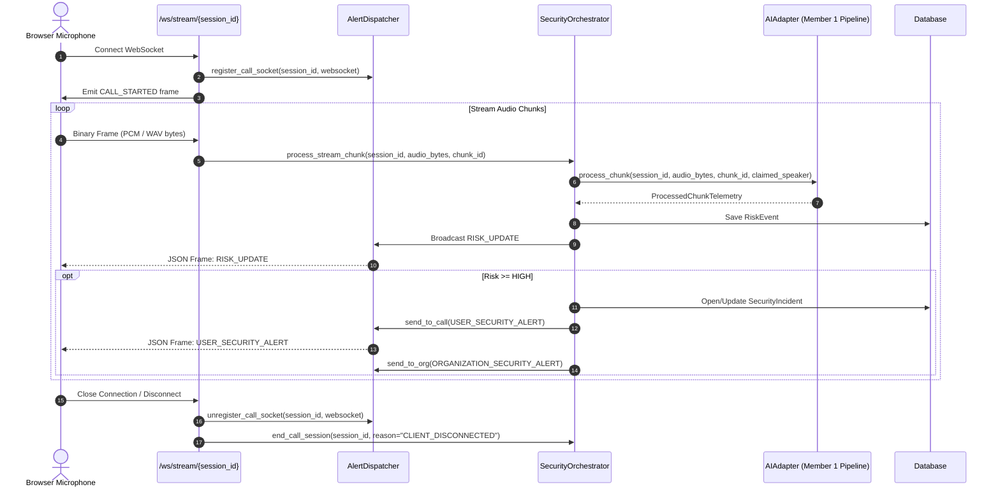

# Request Lifecycle: Synchronous REST & Async WebSockets

## 1. REST Request Lifecycle

Every synchronous REST API request goes through a four-stage pipeline:

### Stage 1: Route Dispatch & Middleware
- Uvicorn parses the HTTP request headers, method, and URI.
- CORS middleware inspects `Origin` and permits all origins (`allow_origins=["*"]`) for hackathon cross-origin prototyping.
- FastAPI deserializes the request body against the designated Pydantic model. Validation errors immediately return `HTTP 422 Unprocessable Entity`.

### Stage 2: Dependency Injection & Authentication
- `get_db`: Yields an active SQLAlchemy `Session` bound to the engine (`SessionLocal`), guaranteed to close in a `finally` block.
- `get_current_user`:
  1. Reads `Authorization: Bearer <token>`.
  2. If missing: raises `HTTP 401 Unauthorized`.
  3. Calls `auth_service.decode_access_token(token)`.
  4. If token invalid/expired: raises `HTTP 401 Unauthorized`.
  5. Queries `db.query(User).filter_by(id=payload["sub"], is_active=True).first()`.
  6. If user not found: raises `HTTP 401 Unauthorized`.
- `require_role(allowed_roles)`:
  - Compares `user.role` against `allowed_roles`.
  - If mismatch: raises `HTTP 403 Forbidden` (`"Access forbidden: Insufficient role permissions."`).

### Stage 3: Service Invocation
- Route handler passes request payload and authenticated `user` context to service classes (`SecurityOrchestrator`, `SpeakerService`, etc.).
- Multi-tenant isolation is maintained by enforcing `org_id=user.org_id` across queries.

### Stage 4: Serialization & Cleanup
- SQLAlchemy models are converted to Pydantic DTOs (`to_dict()` or Pydantic V2 `model_validate`).
- The database session commits or rolls back upon unhandled exceptions.
- The response returns with the corresponding HTTP status code (`200 OK`, `201 Created`, `204 No Content`).

---

## 2. WebSocket Audio Stream Lifecycle

The WebSocket streaming lifecycle governs audio frame ingestion and live telemetry delivery on `/ws/stream/{session_id}`.

### Chunk Handling Details
1. **Binary Intake**: `websocket.receive()` receives raw byte payloads. If text is received, it is ignored or parsed for control signals.
2. **Sequential Chunk ID**: In-memory counter increments per chunk for ordered telemetry tracking.
3. **Graceful Disconnect**: Disconnection cleans up in-memory references in `AlertDispatcher` and marks the session as `ENDED` in the database.

---

## 3. Source Files Covered
- `backend/platform/server/dependencies.py`
- `backend/platform/server/routes/websocket_stream.py`
- `backend/platform/services/orchestrator.py`
- `backend/platform/services/alert_dispatcher.py`
