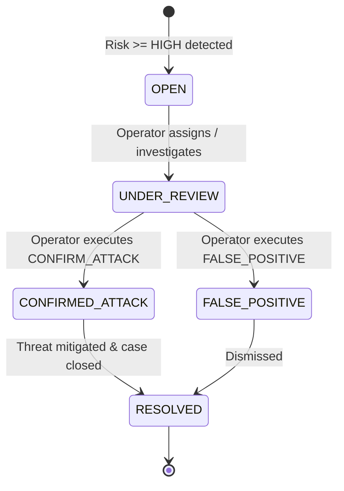

# Security Orchestration: State Machine, Deduplication & Mitigation

## 1. Role of the Security Orchestrator

The `SecurityOrchestrator` (`backend/platform/services/orchestrator.py`) acts as the state manager and security coordinator of the entire application. It bridges streaming audio analysis with relational persistence, organizational policy enforcement, incident lifecycles, and audit logging.

---

## 2. Session-Aware Incident Deduplication Algorithm

A phone call of 30 seconds produces 30 consecutive 1-second audio chunks. If an AI clone is speaking, 20 or more chunks will exhibit high synthetic scores.
Naive systems create a new incident for every chunk, resulting in alert fatigue and database flooding.

### Implementation Logic in `orchestrator.py`:
```python
# Check for active open incident for this session
active_incident = (
    self.db.query(SecurityIncident)
    .filter_by(session_id=session_id)
    .filter(SecurityIncident.status.in_(["OPEN", "UNDER_REVIEW"]))
    .first()
)

if active_incident:
    # Update existing incident in-place
    active_incident.current_risk_score = policy_eval.risk_score
    active_incident.severity = policy_eval.risk_level
    active_incident.synthetic_probability = telemetry.raw_synthetic_prob
    active_incident.speaker_similarity = telemetry.raw_speaker_sim
    active_incident.reasons_json = json.dumps(policy_eval.reasons)
    active_incident.recommended_action = policy_eval.recommended_action
    active_incident.intent = telemetry.intent
    active_incident.updated_at = utcnow()
else:
    # Create single authoritative incident
    active_incident = SecurityIncident(
        org_id=org_id,
        session_id=session_id,
        severity=policy_eval.risk_level,
        scenario=policy_eval.scenario,
        claimed_identity=call.claimed_speaker_id,
        current_risk_score=policy_eval.risk_score,
        synthetic_probability=telemetry.raw_synthetic_prob,
        speaker_similarity=telemetry.raw_speaker_sim,
        intent=telemetry.intent,
        reasons_json=json.dumps(policy_eval.reasons),
        recommended_action=policy_eval.recommended_action,
        status="OPEN",
    )
    self.db.add(active_incident)
```

- **Guaranteed Invariant**: Exactly **one** active incident exists per call session at any time.

---

## 3. Incident Lifecycle State Machine



### Supported Status Transitions
- `OPEN`: Incident automatically created by the system upon detecting high/critical risk.
- `UNDER_REVIEW`: An analyst has acknowledged the alert and is actively reviewing audio metrics.
- `CONFIRMED_ATTACK`: Operator validated that the voice clone or imposter threat is genuine.
- `FALSE_POSITIVE`: Operator reviewed the call and determined the detection was erroneous.
- `RESOLVED`: Mitigation completed and investigation closed.

---

## 4. Operator Mitigation Action Execution

When an operator triggers an action via `POST /api/incidents/{incident_id}/action`:

1. **Validation**: Validates that `action_type` is one of:
   - `CONFIRM_ATTACK`
   - `BLOCK_CALL`
   - `FALSE_POSITIVE`
   - `RESOLVE`
   - `REQUIRE_ADDITIONAL_VERIFICATION`
   - `ESCALATE`
2. **Action Record**: Creates a `SecurityAction` record linked to `incident_id`, `session_id`, and `actor_id`.
3. **Status Transitions**:
   - `CONFIRM_ATTACK` $\rightarrow$ sets `incident.status = "CONFIRMED_ATTACK"`.
   - `FALSE_POSITIVE` $\rightarrow$ sets `incident.status = "FALSE_POSITIVE"`.
   - `RESOLVE` $\rightarrow$ sets `incident.status = "RESOLVED"` and records `resolved_at`.
   - `BLOCK_CALL`:
     - Updates underlying `CallSession`: sets `status = "TERMINATED_BY_SECURITY"`, `end_time = utcnow()`.
     - Emits `CALL_ENDED` with `reason="BLOCKED_BY_SECURITY"` over the caller's WebSocket.
4. **WebSocket Push**: Emits `SECURITY_ACTION` and `INCIDENT_UPDATED` frames over `/ws/org/{org_id}/alerts` so all open SOC dashboards reflect the update in real time.
5. **Audit Event**: Records an immutable row in `audit_logs` with `event_type="SECURITY_ACTION_TAKEN"`.

---

## 5. Source Files Covered
- `backend/platform/services/orchestrator.py`
- `backend/platform/db/models.py`
- `backend/platform/schemas/events.py`
- `backend/platform/schemas/incidents.py`
