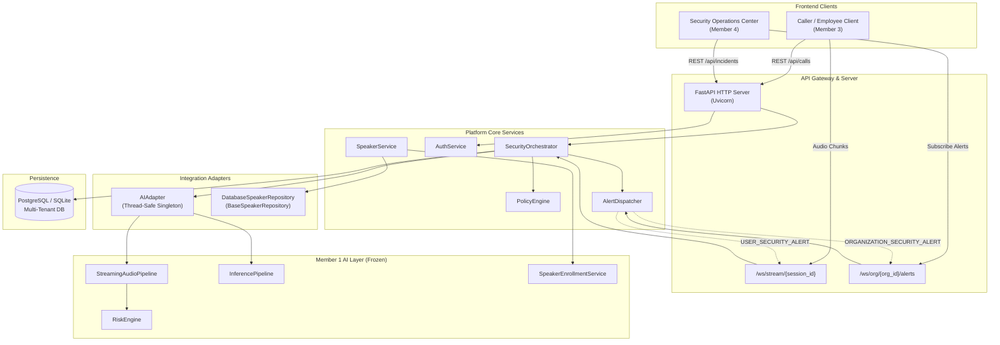

# System Architecture: End-to-End Topology & Subsystems

## 1. Architectural Model

The backend platform is designed as an asynchronous, event-driven monolith optimized for low-latency streaming audio telemetry, relational state management, and real-time WebSocket push notifications.

---

## 2. Core Subsystems

### 2.1 API & Streaming Gateway
- **HTTP Routing**: Dispatches requests for authentication, call session management, incident triage, VIP voice identity enrollment, policy updates, health metrics, and audit queries.
- **WebSocket Streaming (`/ws/stream/{session_id}`)**: Bidirectional connection accepting binary audio buffers (16 kHz mono 16-bit PCM, WAV, WebM) and emitting per-chunk `RISK_UPDATE`, `USER_SECURITY_ALERT`, and `CALL_ENDED` messages.
- **WebSocket SOC Alert Channel (`/ws/org/{org_id}/alerts`)**: Server-to-client broadcast feed delivering live incident creation, status updates, and security action events to security analysts.

### 2.2 Security Orchestration Engine (`SecurityOrchestrator`)
- **Session Lifecycle**: Handles call startup (`start_call_session`) and clean termination (`end_call_session`).
- **Telemetry Ingestion**: Ingests audio chunks, routes them to `AIAdapter`, receives normalized telemetry, queries the active `CallSession`, and records `RiskEvent` entries.
- **Session-Aware Deduplication**: Evaluates whether an incident is already open for the call. If open, updates the incident's risk score, severity, and reasons. If not, opens a new `SecurityIncident`.
- **Mitigation Execution**: Translates operator action requests (`CONFIRM_ATTACK`, `BLOCK_CALL`, `FALSE_POSITIVE`, `RESOLVE`, `REQUIRE_ADDITIONAL_VERIFICATION`, `ESCALATE`) into database updates, socket broadcasts, and call termination commands.

### 2.3 Policy Engine (`PolicyEngine`)
- Evaluates multi-factor acoustic risk against organizational rules.
- Contains VIP protection logic: checks if `claimed_speaker_id` matches an enrolled protected identity with `risk_priority="CRITICAL"`. If deepfake probability is elevated, escalates immediately to `CRITICAL`.
- Parses detected intent keywords: elevates sensitive requests (`OTP_REQUEST`, `PAYMENT_TRANSFER`, `CREDENTIAL_REQUEST`, `URGENT_REQUEST`) to high-priority incidents.

### 2.4 Persistence Subsystem (`SQLAlchemy`)
- Single declarative base (`Base`) in `backend/platform/db/session.py`.
- Ten primary database tables:
  1. `organizations`: Tenant root.
  2. `users`: Multi-tenant identity and RBAC credentials.
  3. `protected_identities`: VIP identity registry (CFO, executives).
  4. `speaker_profiles`: Biometric 192-D embedding vectors linked 1:1 to identities.
  5. `call_sessions`: Telephony and streaming session states.
  6. `risk_events`: Time-series telemetry records per audio chunk.
  7. `security_incidents`: Tracked security cases.
  8. `security_actions`: Incident mitigation audit log.
  9. `security_policies`: Organization-level risk thresholds.
  10. `audit_logs`: Immutable chronological security event log.

---

## 3. Concurrency & Asynchronous Design
- **FastAPI / AnyIO**: Asynchronous request handling across route handlers.
- **In-Memory WebSocket Hub**: Thread-safe in-memory mapping within `AlertDispatcher`:
  - `_call_sockets: Dict[str, Set[WebSocket]]` (keyed by `session_id`)
  - `_org_sockets: Dict[str, Set[WebSocket]]` (keyed by `org_id`)
- **Non-Blocking AI Pipeline**: Model inference operations execute in worker threads or fast CPU inference engines (int8 Faster-Whisper, PyTorch C++ bindings for DeepfakeCNN and ECAPA-TDNN).

---

## 4. Source Files Covered
- `backend/platform/server/app.py`
- `backend/platform/server/routes/websocket_stream.py`
- `backend/platform/services/orchestrator.py`
- `backend/platform/services/alert_dispatcher.py`
- `backend/platform/services/policy_engine.py`
- `backend/platform/db/models.py`
- `backend/platform/db/session.py`
