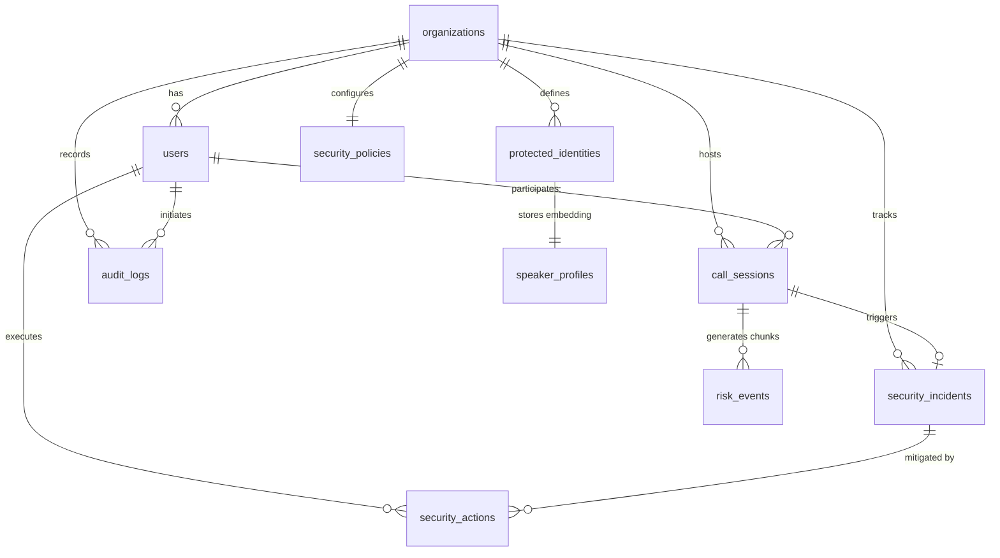

# Entity Relationships & Integrity Constraints

## 1. Relational Map

---

## 2. Foreign Key & Cascade Policies

1. **`organizations` $\rightarrow$ `users`**:
   - `users.org_id` references `organizations.id`.
   - Cannot delete organization while active users exist.

2. **`protected_identities` $\rightarrow$ `speaker_profiles`**:
   - `speaker_profiles.identity_id` references `protected_identities.id` with `UNIQUE` constraint.
   - Cascade policy: `cascade="all, delete-orphan"` ensures deleting a VIP identity purges biometric vector embeddings.

3. **`call_sessions` $\rightarrow$ `risk_events`**:
   - `risk_events.session_id` references `call_sessions.session_id`.
   - Cascade policy: `cascade="all, delete-orphan"` ensures purging call records purges high-frequency chunk telemetry.

4. **`security_incidents` $\rightarrow$ `security_actions`**:
   - `security_actions.incident_id` references `security_incidents.incident_id`.
   - Action log is preserved for audit compliance.

---

## 3. Source Files Covered
- `backend/platform/db/models.py`
