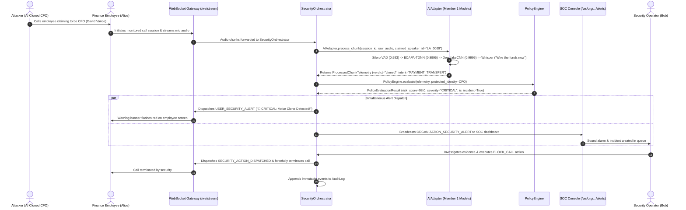

# Integration: Canonical End-to-End Demonstration

This document describes the canonical Smart India Hackathon (SIH) demonstration scenario: **AI-Cloned CFO Voice Impersonation Attack**.

---

## 1. Attack Scenario Overview

An attacker uses a deep learning voice synthesis model conditioned on genuine audio of Chief Financial Officer **David Vance** (`LA_0069`). The attacker calls an employee in the finance department (Alice Johnson), claiming to be David Vance and demanding an urgent wire transfer and confirmation OTP.

---

## 2. Step-by-Step Execution Path & Component Traceability

---

## 3. Ground-Truth Data at Each Step

### Step 1: Session Registration
- Source: [`backend/platform/server/routes/calls.py`](file:///Users/dhurgadevi/Documents/GitHub/VoiceCloneDetection-SIH/backend/platform/server/routes/calls.py)
- Caller claims identity: `David Vance` (`speaker_id = "LA_0069"`).
- Session created with status `ACTIVE`.
- Audit Log recorded: `CALL_STARTED`.

### Step 2: Audio Chunk Ingestion
- Source: [`backend/platform/server/routes/websocket_stream.py`](file:///Users/dhurgadevi/Documents/GitHub/VoiceCloneDetection-SIH/backend/platform/server/routes/websocket_stream.py)
- Binary audio chunk received via `/ws/stream/{session_id}`.

### Step 3: Neural Model Inferences (Member 1)
- Source: [`backend/platform/services/ai_adapter.py`](file:///Users/dhurgadevi/Documents/GitHub/VoiceCloneDetection-SIH/backend/platform/services/ai_adapter.py)
- **VAD (Silero)**: `prob = 0.993` (speech present).
- **ECAPA-TDNN Biometrics**: `cosine_sim = 0.8995` against stored embedding of `LA_0069` (matches CFO voice).
- **DeepfakeCNN v2**: `synthetic_prob = 0.9995` (synthetic voice confirmed).
- **Whisper ASR**: Extracted text: *"Please approve the wire transfer immediately."*
- **IntentDetector**: Flags `PAYMENT_TRANSFER` with high confidence.
- **Member 1 Verdict**: `cloned`.

### Step 4: Policy Engine Evaluation
- Source: [`backend/platform/services/policy_engine.py`](file:///Users/dhurgadevi/Documents/GitHub/VoiceCloneDetection-SIH/backend/platform/services/policy_engine.py)
- Detects protected VIP executive rule violation + sensitive transfer intent.
- Resulting `risk_score = 98.0`, `risk_level = "CRITICAL"`.

### Step 5: Dual Real-Time Alert Dispatch
- Source: [`backend/platform/services/alert_dispatcher.py`](file:///Users/dhurgadevi/Documents/GitHub/VoiceCloneDetection-SIH/backend/platform/services/alert_dispatcher.py)
- `USER_SECURITY_ALERT` sent to employee.
- `ORGANIZATION_SECURITY_ALERT` sent to all active SOC operator consoles.

### Step 6: Incident Creation & Deduplication
- Source: [`backend/platform/services/orchestrator.py`](file:///Users/dhurgadevi/Documents/GitHub/VoiceCloneDetection-SIH/backend/platform/services/orchestrator.py)
- Single `SecurityIncident` created (`status = "OPEN"`). Subsequent attack chunks increment `attack_chunks_detected` without creating duplicate incidents.
- Audit Log recorded: `INCIDENT_CREATED`.

### Step 7: Operator Action & Mitigation
- Source: [`backend/platform/server/routes/incidents.py`](file:///Users/dhurgadevi/Documents/GitHub/VoiceCloneDetection-SIH/backend/platform/server/routes/incidents.py)
- Operator clicks **Block Call** (`POST /api/incidents/{id}/action` with `BLOCK_CALL`).
- Call status set to `BLOCKED`.
- Disconnect message dispatched to caller stream WebSocket; socket severed.
- Audit Log recorded: `SECURITY_ACTION_TAKEN`.
- Audit Log recorded: `CALL_ENDED`.

---

## 4. Evaluator & Demo Script

When demonstrating to judges:
1. Open the Employee screen and Operator SOC dashboard side-by-side in split view.
2. Start call claiming CFO identity.
3. Stream the pre-recorded cloned CFO audio.
4. Point out the simultaneous red alerts appearing instantly on both screens ($< 300\text{ ms}$).
5. Point out the high acoustic confidence ($0.9995$) and speaker biometric match ($0.8995$).
6. Click **Block Call** from the SOC dashboard and observe immediate call termination on the employee's screen.
7. Open the Audit Log to show the tamper-proof compliance chain.
