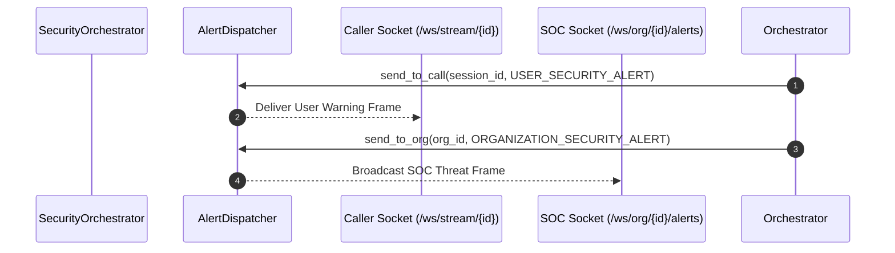

# Alert Routing & Simultaneous Dispatch

## 1. Dual Alert Routing Architecture

When an ongoing call reaches high or critical severity, the backend executes a simultaneous multi-socket fan-out:



---

## 2. Channel Payloads

### 2.1 Caller Channel (`USER_SECURITY_ALERT`)
```json
{
  "event": "USER_SECURITY_ALERT",
  "timestamp": "2026-09-05T12:00:00Z",
  "data": {
    "session_id": "call_123456",
    "severity": "CRITICAL",
    "risk_score": 98.5,
    "warning_message": "CRITICAL SECURITY ALERT: High-probability AI voice cloning detected! Do not disclose OTPs or execute payments.",
    "claimed_identity": "David Vance (CFO)",
    "reasons": [
      "CRITICAL: High speaker match combined with high synthetic probability indicates AI clone of enrolled speaker.",
      "Sensitive conversational intent detected: PAYMENT_TRANSFER"
    ],
    "recommended_action": "BLOCK_OR_ESCALATE"
  }
}
```

### 2.2 SOC Channel (`ORGANIZATION_SECURITY_ALERT`)
```json
{
  "event": "ORGANIZATION_SECURITY_ALERT",
  "timestamp": "2026-09-05T12:00:00Z",
  "data": {
    "incident_id": "inc_987654",
    "org_id": "org_demo_001",
    "session_id": "call_123456",
    "severity": "CRITICAL",
    "scenario": "AI_CLONE_ENROLLED_SPEAKER",
    "risk_score": 98.5,
    "claimed_identity": "LA_0069",
    "synthetic_probability": 0.9995,
    "speaker_similarity": 0.9120,
    "intent": "PAYMENT_TRANSFER",
    "reasons": [
      "CRITICAL: High speaker match combined with high synthetic probability indicates AI clone of enrolled speaker.",
      "Sensitive conversational intent detected: PAYMENT_TRANSFER"
    ],
    "recommended_action": "BLOCK_CALL"
  }
}
```

---

## 3. Concurrency & Dead Socket Cleanup
- `AlertDispatcher.send_to_call` and `send_to_org` iterate over target sets using `asyncio.gather` or sequential transmission.
- If a client has disconnected without cleanly closing, `send_text()` raises `WebSocketDisconnect`.
- The dispatcher automatically captures the exception, removes the dead socket from the pool, and continues delivery to other active connections.

---

## 4. Source Files Covered
- `backend/platform/services/alert_dispatcher.py`
- `backend/platform/services/orchestrator.py`
- `backend/platform/schemas/events.py`
